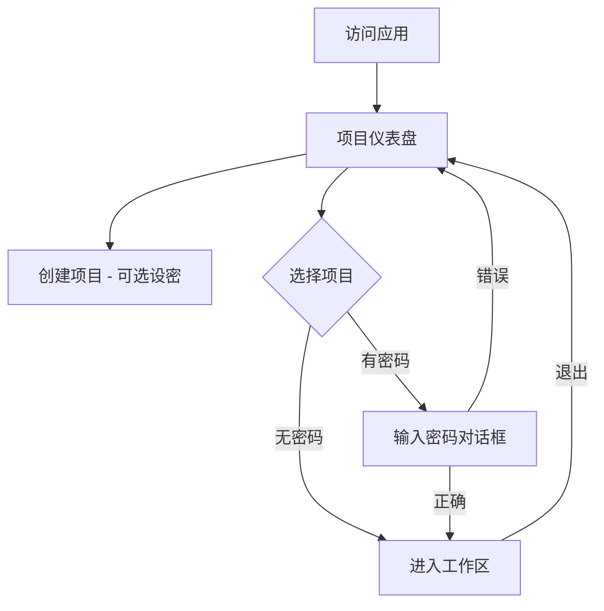

# Design: Remove Authentication and Add Project Password Protection

## Architecture Overview
我们将简化系统的状态流，从 `Unauthenticated -> Dashboard -> Workspace` 变为 `Dashboard -> [Password Check] -> Workspace`。

## Data Schema Changes

### `Project` Interface (in `types.ts`)
```typescript
export interface Project {
  id: string;
  // ownerId: string; // 移除或设为可选
  name: string;
  description?: string;
  password?: string; // 新增：可选密码，存储为明文（由于本地 LocalStorage 环境，加密意义有限，主要用于简单的 UI 隔离）
  createdAt: number;
  updatedAt: number;
  data: {
    participants: Participant[];
    prizes: Prize[];
  };
}
```

## Storage Logic Changes (`utils/storage.ts`)
- `getProjects()`: 不再接收 `userId`，返回 `LocalStorage` 中的所有项目。
- `createProject(name, description, password)`: 增加 `password` 参数。
- 移除所有 `User` 相关的存储和查询逻辑，保持代码整洁。

## UI Component Changes

### 1. `App.tsx` (Orchestrator)
- 移除 `currentUser` 状态。
- 逻辑简化：
  ```tsx
  if (!currentProject) {
    return <ProjectDashboard onSelectProject={handleSelectProject} />;
  }
  return <Workspace project={currentProject} ... />;
  ```

### 2. `ProjectDashboard.tsx`
- **Header**: 移除登录状态信息。
- **Create Project Modal**: 增加 `<input type="password" />` 字段，标记为“可选”。
- **Project Selection**:
  - 点击卡片时，检查 `project.password`。
  - 如果存在密码，打开一个新的“输入密码”模态框。
  - 只有当用户输入的密码与 `project.password` 匹配时，才调用 `onSelectProject`。

### 3. `Workspace.tsx`
- 无需重大更改，但需确保其退出逻辑返回到新的 `ProjectDashboard`。

## Security Considerations
由于这是一个纯客户端应用，所有数据都存储在用户的浏览器 `LocalStorage` 中。本项目提供的密码功能是一种“软保护”，主要防止在共享屏幕或共享电脑时，他人误操作或直接点击进入敏感的抽奖配置界面。

## UI Flow Diagram

